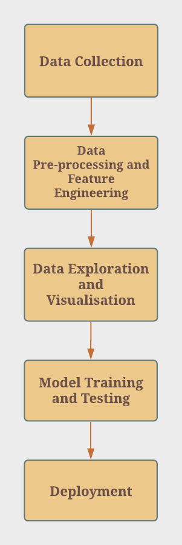
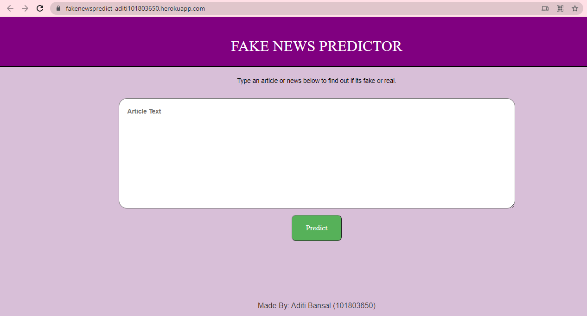

# Detection of Fake News Article : Project Overview🎯
## Problem Statement
In recent years, misinformation and disinformation campaigns have become increasingly prevalent around the world. 

Disinformation campaigns are a new form of asymmetrical information warfare, in which a coordinated effort is made to manipulate public manipulations. 
According to the U.S. Department of State, "the top one percent of fake news stories typically reached between 1,000 and 100,000 people, whereas true stories rarely exceeded an audience of one thousand."

## Natural Language Processing and Machine Learning problem
Predict whether an article is fake news or not on the input parameters like title, author and text. 
<b>Type</b> : Supervised Learning 
<b>Task</b> : Binary classification 
<b>Performance metric</b>  Accuracy 

## About Dataset
Source : https://www.kaggle.com/c/fake-news/data

### Attribute Information
<b>id</b>: unique id for a news article 
<b>title</b>: the title of a news article 
<b>author</b>: author of the news article 
<b>text</b>: the text of the article; could be incomplete 
<b>label</b>: a label that marks the article as potentially unreliable 
- 1: unreliable
- 0: reliable

## Tools and Technologies used🛠
- Windows 10 OS 
- Python 3.9.0
- Pandas
- Numpy
- Malplotlib 
- Seaborn 
- Sklearn
- Nltk
- Torch
- Transformers
- Flask
- HTML
- CSS
- BootStrap 
- Deployed on Heroku cloud

## Methodology

## Result
**A web application to detect whether the article is fake or real news based on factors like author, title, etc.**
- Live app :- https://fakenewspredict-aditi101803650.herokuapp.com/
- The model was trained and validated on 44k+ articles
- Achieved Accuracy of 0.986 and F1 score of 0.985 

## Novelty
- Explored two different approaches:
1. Multi-layer Perceptron
2. BERT Fine-tuning
- For both models, performed optimization
